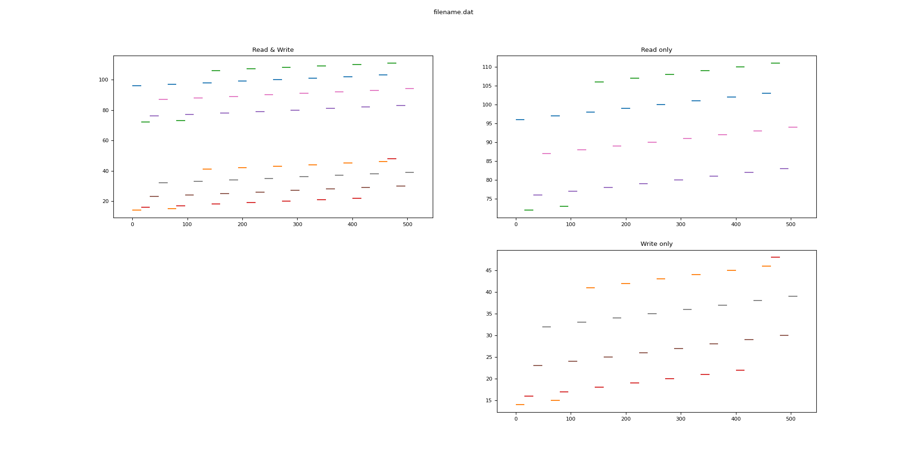

# adio-testfs-visualizer
An I/O visualizer for [ADIO_TESTFS](https://github.com/pmodels/mpich/tree/master/src/mpi/romio/adio/ad_testfs) in [MPICH](https://www.mpich.org/). This python script visualizes all I/O requests in passed log file.
This script draw entire I/O logs, so intended for a debug-purpose on an application with small outputs of data.

## Supported Application Types
- An application that use MPI-IO interface as an I/O middleware
- An application that can use with ADIO_TESTFS
  - ADIO_TESTFS is a feature which included in ADIO and returns stdout as a file descriptor at a file open

## Usage
1. Run your MPI application with a testfs-prefixed path (e.g. `testfs:/path/to/file`)
1. Record and save outputs from ADIO_TESTFS to a file during the execution (Use GNU screen if necessary)
1. Run `python3 main.py /path/to/recorded-stdout`

## Example
1. Run [IOR](https://github.com/hpc/ior): `mpirun -np 4 ior -o testfs:filename.dat -a MPIIO -C -t 16 -b 16 -s 8 -w -r > ior.testfs.log`
1. Run Visualizer: `python3 main.py ior.testfs.log`

